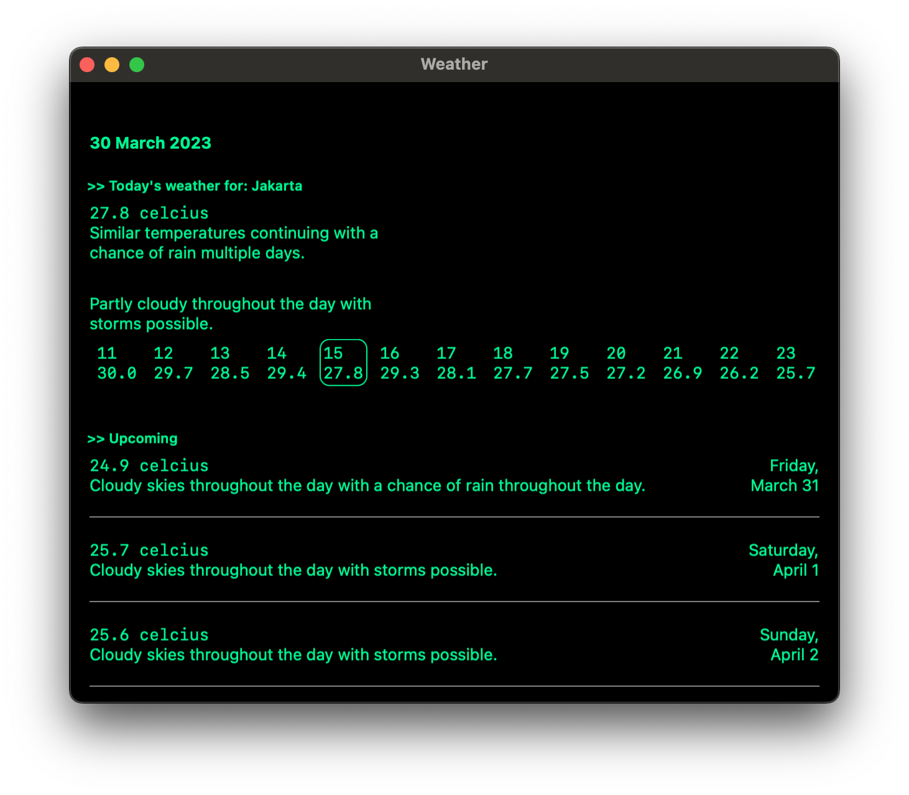

#  Weather

---

Simple, Minimalistic weather for MacOS. Using [Visual Crossing](https://www.visualcrossing.com/weather-api) as the API.

## Notes
`cmd + F` to enable the search bar.
`cmd + R` to refresh.
